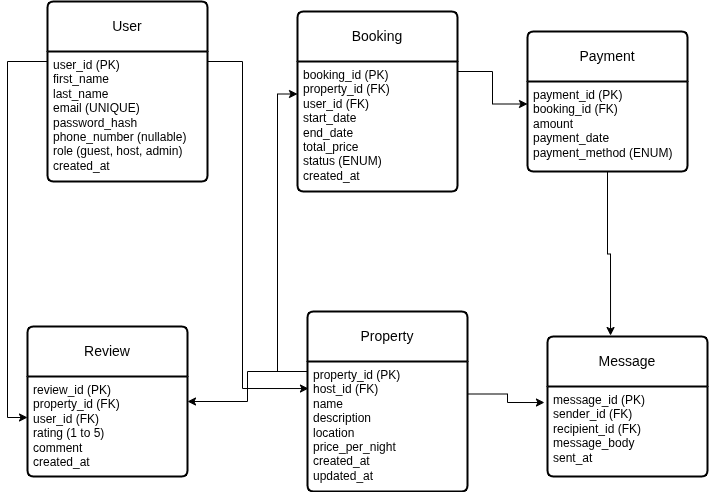

## Entity-Relationship Diagram

This ER diagram outlines the core entities and relationships for the AirBnB database system. It includes User, Property, Booking, Payment, Review, and Message tables, with primary/foreign keys and constraints clearly defined.
